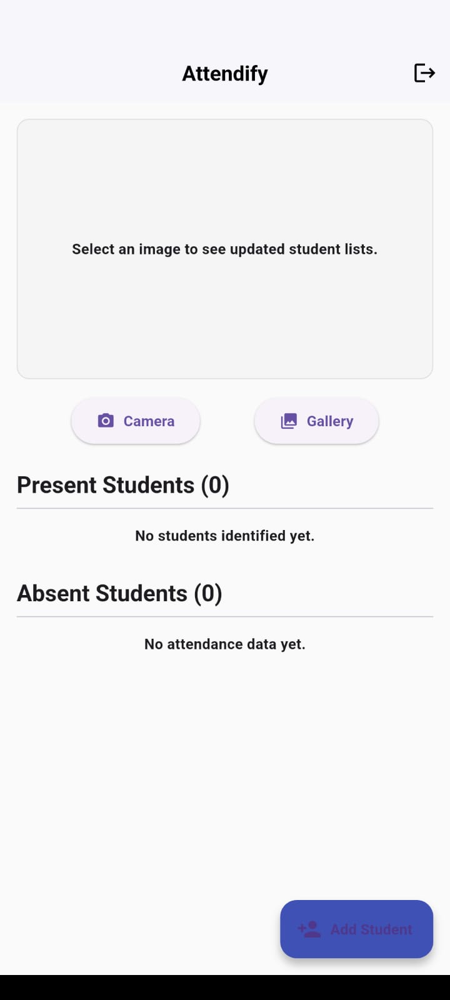

# Attendify: AI-Powered Smart Attendance System

Attendify is an intelligent, multi-platform attendance management system that automates student attendance using advanced facial recognition techniques. The system integrates a high-performance Python-based backend with both a secure web interface and a cross-platform mobile application.

By leveraging deep learning models such as YOLOv8l for face detection and FaceNet for recognition, Attendify ensures reliable performance even in complex, real-world classroom environments.

---

## Overview

Attendify follows a client-server architecture that separates computationally intensive AI processing from user-facing interfaces. This design ensures scalability, maintainability, and efficient deployment across platforms.

The system enables educators to enroll students, capture attendance through images, and generate accurate reports with minimal manual intervention.

---

## Features

### High-Accuracy Face Recognition
- YOLOv8l for robust face detection  
- FaceNet for 128-dimensional facial embeddings  
- Handles variations in lighting, pose, and occlusion  

### Multi-Platform Access
- **Web Portal:** Manage students, upload images, view attendance  
- **Mobile App:** Flutter-based cross-platform application  

### Dynamic Student Enrollment
- Add student name, roll number, and image  
- Automatically generates and stores face embeddings  

### Automated Attendance
- Upload group image  
- Detect and recognize faces  
- Generate attendance report and annotated output  

### Secure Authentication
- Session-based login system for authorized access  

---

## Tech Stack

### Backend
- Flask (Python)  
- OpenCV, PyTorch  
- YOLOv8l-face  
- FaceNet (`facenet-pytorch`, VGGFace2)  
- Pandas, NumPy  

### Web Frontend
- HTML, CSS, JavaScript  
- Tailwind CSS  

### Mobile App
- Flutter (Dart)  
- `http` package  
- `image_picker`  

---

## System Pipeline

### Enrollment Pipeline
1. User submits student details and image  
2. YOLOv8l detects face  
3. FaceNet generates 128-D embedding  
4. Data stored in database  

### Attendance Pipeline
1. Upload group image  
2. Detect faces using YOLOv8l  
3. Generate embeddings using FaceNet  
4. Compare using cosine similarity  
5. Generate attendance report and annotated image  

---

## Getting Started

### Prerequisites
- Python 3.8+  
- Flutter SDK  
- Git  

---

### 1. Clone Repository
```bash
git clone https://github.com/your-username/attendify.git
cd attendify
```

---

### 2. Backend Setup
```bash
cd backend_server
python -m venv venv
```

Activate environment:

**Windows**
```bash
venv\Scripts\activate
```

**macOS/Linux**
```bash
source venv/bin/activate
```

Install dependencies:
```bash
pip install -r requirements.txt
```

Additional setup:
- Place student data in `/data`
- Ensure `students.csv` exists
- Download `yolov8l-face.pt` model

Initialize database:
```bash
python create_database.py
```

Run server:
```bash
python app.py
```

---

### 3. Mobile App Setup
```bash
cd ../frontend_app
flutter pub get
```

Update API URL in:
```
lib/main.dart
```

Run app:
```bash
flutter run
```

---

## Usage

Open in browser:
```
http://127.0.0.1:5000
```

**Default Login**
- Username: teacher  
- Password: password  

---

## Project Structure

```
attendify/
│
├── backend_server/
│   ├── app.py
│   ├── create_database.py
│   ├── requirements.txt
│   └── data/
│
├── frontend_app/
│   ├── lib/
│   └── pubspec.yaml
│
├── images/
└── README.md
```

---

## Future Enhancements

- Real-time attendance using live video stream  
- Cloud deployment (AWS/GCP)  
- Role-based authentication (Admin/Teacher/Student)  
- Attendance analytics dashboard  

---

## License

This project is intended for academic and educational purposes.

## Screenshots

### Login Screen  
  

### Web Dashboard  
  

### Mobile App  
  

- Secure login portal for authorized users.  
- Main dashboard for enrolling students and marking attendance.  
- On-the-go attendance with Flutter.  
